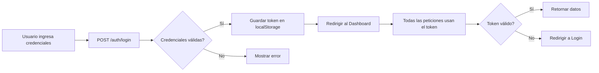

# 🏋️ Sistema de Gestión de Gimnasio - Configuración Supabase

## Gimnasio Los Teques - Sector Lagunetica

---

## 🚀 INICIO RÁPIDO (3 Pasos)

### 1️⃣ Ejecutar Schema SQL en Supabase

1. Ve a https://supabase.com/dashboard
2. Abre **SQL Editor** → **New Query**
3. Copia TODO el contenido de `/supabase/migrations/schema.sql`
4. Pégalo y haz clic en **RUN**
5. Verifica que aparezca "✅ Success"

### 2️⃣ Crear Usuarios de Prueba

**Opción A - Automático (Recomendado):**
```bash
curl -X POST https://TU_PROJECT_ID.supabase.co/functions/v1/make-server-104060a1/seed
```

**Opción B - Desde la App:**
```tsx
import { DatabaseSetup } from './components/DatabaseSetup';
// Renderiza <DatabaseSetup /> y haz clic en "Inicializar"
```

### 3️⃣ ¡Listo! Inicia Sesión

```
Administrador:
📧 admin@gymteques.com
🔑 Admin123!

Entrenador:
📧 trainer@gymteques.com
🔑 Trainer123!

Recepción:
📧 recepcion@gymteques.com
🔑 Recepcion123!
```

---

## 📚 DOCUMENTACIÓN COMPLETA

### 📖 Guías Disponibles

| Archivo | Descripción |
|---------|-------------|
| **INSTRUCCIONES_SUPABASE.md** | Guía paso a paso detallada |
| **GUIA_VISUAL_SUPABASE.md** | Tutorial visual con ejemplos |
| **SUPABASE_STRUCTURE.md** | Estructura completa de BD |
| **RESUMEN_CONFIGURACION.md** | Resumen técnico completo |
| **README_SUPABASE.md** | Este archivo (inicio rápido) |

---

## 🗄️ ESTRUCTURA DE BASE DE DATOS

### 12 Tablas Principales

```
📊 users                    → Miembros del gimnasio
👥 staff                    → Personal (Admin, Trainer, Reception)
💳 payments                 → Pagos/mensualidades
📅 attendance               → Control de asistencia
📈 physical_progress        → Seguimiento físico
🏋️ routine_templates        → Plantillas de rutinas
💪 exercise_templates       → Ejercicios
📋 user_routine_assignments → Rutinas asignadas
⏱️  workout_sessions         → Sesiones de entrenamiento
📝 workout_exercise_logs    → Logs de ejercicios
🔢 set_logs                 → Logs de series
🧾 invoices                 → Facturas
```

### 3 Roles de Usuario

| Rol | Permisos |
|-----|----------|
| **Administrador** | Acceso total al sistema |
| **Entrenador** | Rutinas, progreso físico, ver usuarios |
| **Recepción** | Pagos, asistencia, usuarios |

---

## 💻 USO DEL CLIENTE API

### Importar el Cliente

```typescript
import api from './lib/api';
```

### Ejemplos de Uso

#### Login
```typescript
const response = await api.auth.login('admin@gymteques.com', 'Admin123!');
console.log(response.staff); // Datos del usuario logueado
```

#### Obtener Usuarios
```typescript
const users = await api.users.getAll();
console.log(users); // Array de usuarios
```

#### Crear Pago
```typescript
const payment = await api.payments.create({
  user_id: 'uuid-del-usuario',
  amount: 50.00,
  date: new Date().toISOString(),
  next_payment: '2025-03-25',
  status: 'Pagado',
  method: 'Efectivo'
});
```

#### Estadísticas del Dashboard
```typescript
const stats = await api.stats.getDashboard();
console.log(stats.totalUsers);      // Total de usuarios
console.log(stats.monthlyRevenue);  // Ingresos del mes
console.log(stats.todayAttendance); // Asistencia hoy
```

---

## 🛠️ ENDPOINTS DISPONIBLES

### Autenticación
```
POST   /make-server-104060a1/auth/login
POST   /make-server-104060a1/auth/signup
GET    /make-server-104060a1/auth/session
POST   /make-server-104060a1/auth/logout
```

### CRUD
```
GET/POST/PUT/DELETE  /make-server-104060a1/users
GET/POST             /make-server-104060a1/payments
GET/PUT              /make-server-104060a1/staff
GET/POST             /make-server-104060a1/attendance
GET/POST             /make-server-104060a1/routines
GET/POST             /make-server-104060a1/routine-assignments
```

### Utilidades
```
GET    /make-server-104060a1/stats    (Estadísticas dashboard)
POST   /make-server-104060a1/seed     (Crear datos de prueba)
GET    /make-server-104060a1/health   (Health check)
```

---

## ��� TESTING

### Página de Test Incluida

Usa la página `/src/app/pages/TestSupabase.tsx` para probar todos los endpoints:

```tsx
import TestSupabase from './pages/TestSupabase';

// Renderiza esta página para hacer tests
<TestSupabase />
```

Esta página te permite:
- ✅ Verificar conexión con Supabase
- ✅ Probar login
- ✅ Probar todos los endpoints CRUD
- ✅ Ver respuestas en tiempo real

---

## 🔐 SEGURIDAD

### Row Level Security (RLS)

✅ **Todas las tablas tienen RLS habilitado**
✅ **Políticas específicas por rol**
✅ **Autenticación con Supabase Auth**
✅ **Tokens JWT seguros**

### Matriz de Permisos

| Operación | Admin | Trainer | Reception |
|-----------|-------|---------|-----------|
| Gestionar Staff | ✅ | ❌ | ❌ |
| Ver Usuarios | ✅ | ✅ | ✅ |
| Crear/Editar Usuarios | ✅ | ❌ | ✅ |
| Eliminar Usuarios | ✅ | ❌ | ❌ |
| Gestionar Pagos | ✅ | Ver | ✅ |
| Registrar Asistencia | ✅ | Ver | ✅ |
| Crear Rutinas | ✅ | ✅ | Ver |
| Editar Rutinas | ✅ | Propias | Ver |

---

## 📦 ARCHIVOS IMPORTANTES

```
/supabase/
├── migrations/
│   └── schema.sql              ← Schema SQL (Ejecutar en Supabase)
└── functions/server/
    ├── index.tsx               ← Servidor con endpoints
    ├── seed.tsx                ← Datos de prueba
    └── kv_store.tsx            ← [Sistema] No editar

/src/app/
├── lib/
│   └── api.ts                  ← Cliente API TypeScript
├── components/
│   └── DatabaseSetup.tsx       ← UI para inicialización
└── pages/
    └── TestSupabase.tsx        ← Página de testing
```

---

## ✅ CHECKLIST DE VERIFICACIÓN

Antes de comenzar a desarrollar:

- [ ] Schema SQL ejecutado en Supabase
- [ ] 12 tablas visibles en Table Editor
- [ ] Endpoint `/seed` ejecutado
- [ ] 3 usuarios en Authentication
- [ ] 5 miembros en tabla `users`
- [ ] Login funciona con admin@gymteques.com
- [ ] Cliente API importado en tu código
- [ ] Página de test funciona correctamente

---

## 🆘 SOLUCIÓN DE PROBLEMAS

### ❌ "Database error querying schema"
**✅ Ejecuta el schema SQL** en Supabase SQL Editor

### ❌ "Usuario no encontrado en staff"
**✅ Ejecuta el seed** para crear usuarios de prueba

### ❌ "Invalid token" / "Unauthorized"
**✅ Verifica** que el token esté en localStorage o vuelve a hacer login

### ❌ Tablas no aparecen
**✅ Refresca** el Table Editor y verifica que el SQL se ejecutó sin errores

---

## 🔄 FLUJO DE AUTENTICACIÓN



---

## 📊 DATOS DE PRUEBA INCLUIDOS

### Personal (3 usuarios)
- **Roberto Administrador** - Acceso total
- **Laura Entrenadora** - Rutinas y progreso
- **Pedro Recepcionista** - Pagos y asistencia

### Miembros (5 usuarios)
- **Carlos Rodríguez** (GYM-001) - Activo, Plan Mensual
- **María González** (GYM-002) - Activo, Plan Trimestral
- **José Pérez** (GYM-003) - Moroso, Plan Mensual
- **Ana Martínez** (GYM-004) - Activo, Plan Anual
- **Luis Hernández** (GYM-005) - Inactivo

### Pagos (2 ejemplos)
- Pago de Carlos - $50.00 (Efectivo)
- Pago de María - $135.00 (Transferencia)

---

## 🎯 PRÓXIMOS PASOS SUGERIDOS

1. **Integrar Login** en tu componente principal
2. **Conectar Dashboard** con estadísticas reales (`api.stats.getDashboard()`)
3. **Implementar CRUD de Usuarios** en la página Users
4. **Implementar Gestión de Pagos** con alertas de vencimiento
5. **Crear Rutinas** y asignarlas a miembros
6. **Implementar Registro de Asistencia** con QR (opcional)
7. **Dashboard de Progreso Físico** con gráficas

---

## 📖 RECURSOS ADICIONALES

### Documentación Oficial
- **Supabase Docs:** https://supabase.com/docs
- **Supabase Auth:** https://supabase.com/docs/guides/auth
- **Row Level Security:** https://supabase.com/docs/guides/auth/row-level-security

### Comunidad
- **Discord de Supabase:** https://discord.supabase.com
- **GitHub:** https://github.com/supabase/supabase

---

## 🎉 ¡TODO LISTO!

Tu sistema de gestión de gimnasio está completamente configurado con:

✅ Base de datos completa (12 tablas)
✅ Autenticación funcionando (3 roles)
✅ Seguridad implementada (RLS)
✅ API REST completa
✅ Cliente TypeScript
✅ Datos de prueba
✅ Documentación completa

**¡Ahora puedes comenzar a desarrollar! 💪🏋️‍♂️**

---

**Creado para:** Gimnasio Los Teques, Sector Lagunetica
**Fecha:** Febrero 2026
**Estado:** ✅ Listo para usar
**Versión:** 1.0
